*Note: This document was automatically converted from a PDF to Markdown by an LLM. For the most accurate formatting and content, please refer to the [original PDF](./Final_report.pdf)*

# Data Interpolation in Latent Space

Iddo Yadlin & Dan Botchan

## Abstract:
**The goal of this project is to explore the usage of autoencoders for data interpolation of images. Data interpolation aims at constructing a new set of samples within the range of a given discrete set of data points. We use autoencoder, an unsupervised neural network, that learns a reduced representation of the dataset defined as the latent space. We present an approach for creating new image samples by performing linear interpolations in the latent domain.*

## Introduction:
Data interpolation aims at constructing a new set of samples within the range of a given discrete set of data points. In the image domain we can use data interpolation to expand our data or creating convincing transitions between a set of images that results in generation of a faithful animation. interpolation techniques can be used for improving motion in cartoon figures animations and creating extreme slow motion from regularly recorded video sequences.

To demonstrate why this is not a trivial task, consider a dataset of images of a pole with a shape at its top. The dataset is governed by two parameters- the vertical location 1 of the shape, and the horizontal location of the shape. Given two images from this dataset, we’d like to create a realistic set of images from within this range. The naïve approach will be to perform a simple linear interpolation between two images in the pixel domain. Of course, this leads to undesired results as it simply produces a cross-dissolve interpolation between the intensities of the two Images.

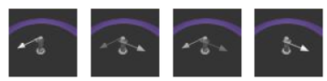

**Figure 1** - Output of using linear interpolation in pixel domain. Leftmost image is source, rightmost image is target. Cross dissolve artifacts can be seen.

Auto-encoders are a type of deep neural network that is trained to obtain a reduced representation for input data.

In this representation, every image in the input has a corresponding point in the latent space. It is a common practice to perform data interpolation by applying linear interpolation in the latent space. However, in some situations this leads to unrealistic artifacts in the interpolated images. 

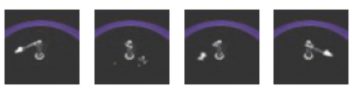

**Figure 2 -** Output of using linear interpolation in latent space. Leftmost image is source, rightmost image is target. Unrealistic artifacts are clearly visible. 

As shown by Oring, Yakhini and Hel-Or’s article [6], These artifacts are likely to be produced when the interpolation points are far from the latent data manifold. To avoid these artifacts, it is necessary to consider the geometry of the latent data.

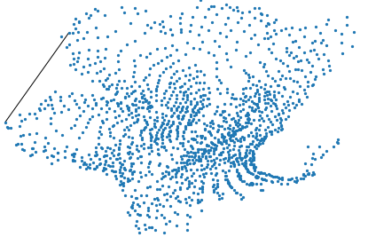

**Figure 3 -** images in latent space. black line connects the source and target images from Figure 1.

## Related Work:
In Bengio, Courville and Vincent paper [1],** **they review the work in the area of representation learning - the process of learning representation for the input data by transforming it to another domain. One of the methods they reviewed was the Autoencoder. Autoencoder is an unsupervised neural network that is trained to reduce the difference between its inputs and outputs [2]. It does so while encoding its input to a hidden layer which its values are in the representation domain, denoted as the latent space. The network then decodes it back into the image space. Autoencoders which have smaller dimension to their hidden layer are called “Undercomplete autoencoders”. Learning undercomplete epresentation forces the latent space to an encoding of the most salient features. Such autoencoders learn the “essence” of the dataset. 

The Denoise Autoencoder (DAE) is another type of autoencoder. DAEs are trained to reduce the difference between an image and output of the network on a corrupted version of the image. According to Vincent [3], the usefulness of DAEs can be explained by the Manifold Hypothesis. According to this hypothesis, real-world data is expected to concentrate in the vicinity of a manifold, of much lower dimension of the input data. By taking a manifold approach to the input dataset, Vincent explains that a DAE encourages similarity in the image domain to be preserved in the latent domain. Latent representation of similar images in the image domain will be close to each other in the latent domain.

In Johnson et al. paper [4] Pihlgren et al. [5], we are presented with a new approach for a loss function that uses a neural network which extracts perceptual features from images. Training with this loss function improves the capability of the autoencoder to decode the data from the latent space to images perceptually similar to the original input.

In Oring, Yakhini and Hel-Or’s article [6], the auto encoder is encouraged to learn a convex manifold. This is done by incorporating convexity loss into the auto encoder’s loss function, which penalizes interpolated latent vectors that differ from a convex latent space. As demonstrated in the article, their approach allows for improved data interpolation, as interpolation in the latent space is closer to the data manifold.

## Dataset & Features
For dataset, we use MPI3D Disentanglement dataset, which is used as a benchmark for representations learning algorithms. We used a dataset called ‘Simplistic rendered images (mpi3d_toy)’, in which the images are a bit smoother and with less unrelated details. This is to help the process of encoding the images into 2d vector in the latent space.

The Dataset consists of 1,036,800 images of 64x64 resolution, corresponding to all the possible combinations of the following factors of variation: Object color - 6 options, object shape - 6 options, object size - 2, camera height - 2, background color - 2, horizontal axis and vertical axis - 40 options each.

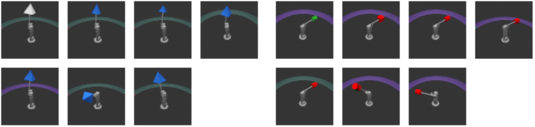

**Figure 4 -**  Example of the different variations **of the data**.* 

For most of our experiments, we used only two degrees of freedom: horizontal axis and vertical axis, which we try to encode into the latent space.
All the other factors were set to a constant value. Object color is white, object shape is cone, size is large, background color is purple, and the height was chosen to be from the top.

This 2-dimensioinal dataset has 1600 images. We chose to train the autoencoder with all of them, because for this task the autoencoder is required to perform well only on this specific dataset. 

## Methods

In this project we try to interpolate between sampled images by “surfing” on the manifold of the data in the latent space, which is learned by the autoencoder. An autoencoder is trained on the dataset using reconstruction loss and content loss. Each input is mapped to a 2d point in the latent space. 

### Autoencoders
Autoencoders are made up of two parts. One part is the encoding function . For an image input , the results of  is the hidden layer .  Second part is the decoding function  which takes vector  as an input and transform it back to the input domain.
In our project we used an undercomplete autoencoder. It means that the hidden layer, has a smaller dimension from the input, forcing the autoencoder to capture the most salient features of the training data.

#### Denoising
In order to prevent from the autoencoder to learn the identity function , we add regularization to the autoencoder. While there are many types of regularization techniques, we chose to use denoising encoder because it must capture the structure of the input manifold in order to undo the corruption effect, and due to our assumption that the decoder will become robust to small changes in the latent space. It's important for the interpolation step. The autoencoder input's is now a corrupted image , such that, and  is a random noise.
The loss function of the DAE, compares between the reconstructed and denoised image -  and the original image , therefore forcing the DAE to learn a reconstruction function, that map the corrupted point in the latent space  to the closet point on the data manifold.

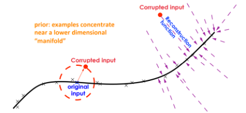

**Figure 5 -** Figure copied from [1]. The reconstruction function learns to associate between corrupted input and the closet **original input.*

### Architecture
The chosen autoencoder architecture was chosen to be denoising undercomplete autoencoder. In the encoder we used a conv-Net structure in order to extract features from the input image. We then flatten the features and pass them through two fully-connected layers. In the end of this pipeline we will get a 2 size vector, represent a point in the latent space. The decoder part has a symmetrical process, but we use less filters in each block. After some experiments we noticed that the use of too much filters in the decoding architecture, doesn't necessarily contribute to the results and has computational cost.

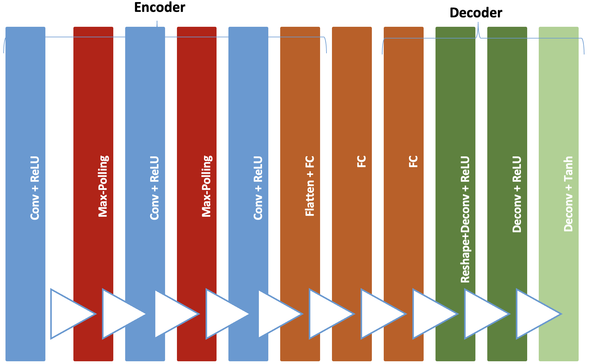

**Figure 6 -** The architecture of the Auto encoder has block diagram.***
### Losses
For the loss function we used two types of losses. One is a reconstruction loss that we chose to be mean squared error, and the other is perceptual loss, that rewards the network based on its ability to understand the content of the image. The reason we use both of them is explained in Philgren et al. paper [5]. MSE is a pixel-wise loss, disregards high-level structures and the relation between them. MSE only cares about each specific pixel will be as close as possible to the same pixel in the target image. Philgren demonstrates how this type of loss can lead to undesired results.

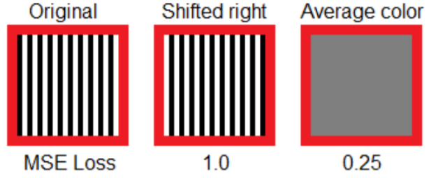

**Figure 7 -**  Two different reconstructions of the left most image and the results of MSE. On the first one each stripe has been moved one pixel** and in the second gray image.

Philgren suggests a new method called perceptual loss, which is a loss that depends on the activation of additional neural network. This perceptual loss network is used to compare between the features  of the original input  and the features of the decoder's output . The features are then compared using MSE to measure the similarity between the features.
Our final loss function is defined by two parameters-  for the reconstruction loss, and  for the perceptual loss. The loss for our DAE is defined as:

During the experiments we tried different values for each coefficient until we got the desired result.

#### MSE Loss
Autoencoders are commonly trained using MSE or BCE as a loss functions. MSE compare for each pixel in the input image, the distance from the value in the output image.
$$L_re=\frac{1}{N}\sum_n^N(x_n-\tilde {x}_n)$$
Where  $n$ is the total number of samples.  $n$ is the current sample, \tilde {x}_n) and  $x_n$ represent output and input number accordingly.

#### Perceptual Loss
We used a Pytorch implantation of VGG-16 as the perceptual loss neural network as described in Johnson et al paper [4]. for our task we didn't need a style transfer, so we used only a Content image. The VGG was fed with both the autoencoder output and the original image as a content target. And both of the features extracted, (accordingly), were compared using MSE again.

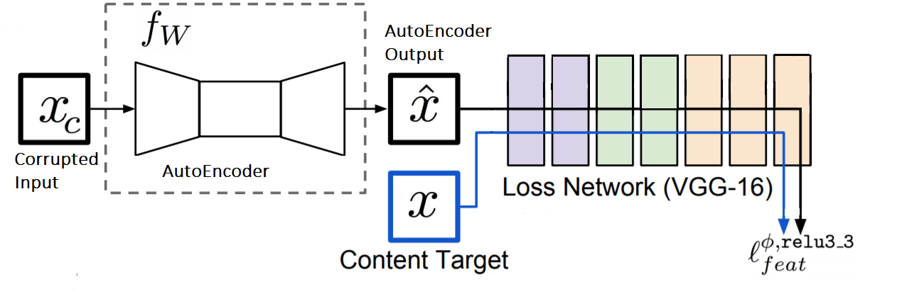
**Figure 8 -** The architecture of the autoencoder, with VGG-16 as perceptual loss network. The output of the encoder ** is compared with the original x.*

## Manifold interpolation
We use a DAE to learn a reduced representation of a dataset of images in the latent space. We connect neighboring points in the graph to create a connected latent space weighted graph which simulates the manifold. The neighbors are chosen by their distance from each other. To perform interpolation between two given images, we find the shortest path between their corresponding points in the latent graph using Dijkstra algorithm. We then, perform linear interpolation between each two subsequent points in this path, generating a set of points in the range of the path. We then generate images by decoding this set of points using our learned decoder.
Each sample can be considered a sample from the desired continuous manifold. Intuitively, and assuming a certain smoothness of this manifold, linear interpolation between two near points in the latent space should be expected to be a good approximation of the desired manifold. Thus, the suggested method for interpolation in latent space is expected to be faithful to the interpolation in the image domain.

## Experiments / Results / Discussion:

### Different Losses:

#### MSE Loss

We trained a DAE using a reconstruction loss of defined as the MSE between the DAE output and the original image. As can be seen in below the DEA successfully reconstructs the decoded image. The decoded image is a bit blurry, especially the object shape.

**Figure 9 -**  original image and output of DAE trained with loss. DAE was trained on images with a small shape, which might also explain why the output image is blurred.

We Used the DAE to encode the dataset images to the latent space, and construct a K-nn graph. We selected the minimal k(=4) for which the latent space graph is connected.

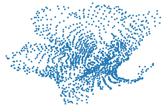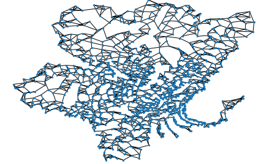

To demonstrate the advantages of surfing the manifold vs. naïve linear interpolation in latent space, consider the following two interpolation paths:

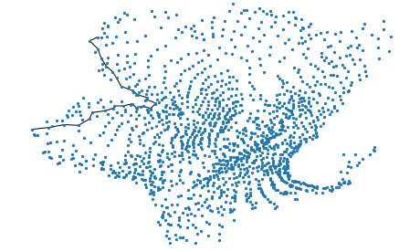

As can be seen in figure on the left, the linear interpolation path is far from the latent space, so we should expect to see unrealistic artifacts. Indeed, the naïve linear interpolation method yielded such artifacts, and surfing the manifold allowed avoiding most of them. Even with surfing the manifold there are still some unrealistic artifacts, but we suspect this is due to the quality of reconstruction of the DAE performance. Interpolation animations are attached to project as *2d_linear.gif* and *2d_surfing.gif*. 

We also used a simplistic method for evaluating interpolation performance, which we call interpolationMSE. We measured the average mean square error of interpolation outputs to closest images in dataset. Indeed, with linear interpolation we reached a score of 8.89, and by surfing the manifold we reached a score of 8.32.

#### Perceptual Losses
**As explained in section 4.2.2., perceptual loss attempts to minimize the difference between features of the input and decoder output. These features were extracted using VGG16. We expect the AE to learn higher order features of the image and provide a sharper looking output.

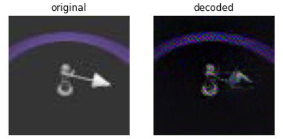

**Figure 13 -** Naïve interpolation path between two points in latent space.***

As can be seen above, the DAE trained with only perceptual loss is able to reconstruct an image similar to the original. The output preserves the higher order features of the object (such as the edges of the objects), but missing some important details (such as the filling of the object).

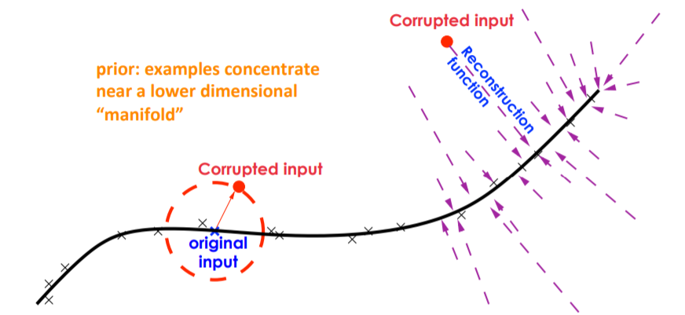

#### MSE and Perceptual Losses

We also trained DAEs using a combination of the two losses. we defined the loss to be .
We used a grid search to check different variations for the coefficients.

as can be seen above, the results for a DAE trained with the combined loss yields better results than a DAE trained on only one of the losses. the output images are sharper, and the lower order features are also preserved.

Using the latent space encoded by the DAE, we created a K-nn graph displayed in the figure below:

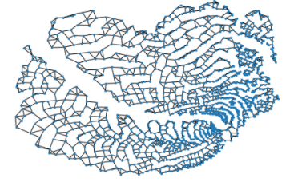

**Figure 16-** K-nn graph from latent space created by DAE traind with a combined loss of perceptual and MSE loss***

Comparing the methods of linear interpolation and manifold surfing led to some interesting results.

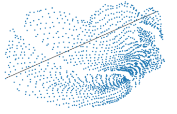
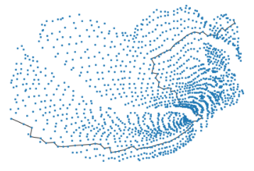

as can be seen in figure 18, the interpolation path generated from surfing the manifold is significantly longer then the linear interpolation path. Indeed, even though the animation created from this path in figure 18 has less unrealistic artifacts and a slightly lower interpolationMSE score, the movement of in the animation is less smooth and natural from the animation generated with linear interpolation. The animations are attached to this project as *2d_linear_with_combined_loss.gif* 2d_surfing_with_combined_loss.gif

In this case it is not obvious that the suggested method is indeed better than naïve linear interpolation. It seems that the reason for this is that the linear interpolation path is always quite close to the data manifold, thus unrealistic artifacts do not appear. In addition, due to how the K-nn graph was built, the shortest path is quite long. It is possible that using a different method for constructing the latent space graph could have solve the issue in this case. For example, instead of connecting the k nearest neighbors for each point, perhaps we can connect all points which are not further than a certain threshold.

### 3D Latent Space

#### Dataset with 2 degrees of freedom
Increasing the dimension of the latent space when training the DAE on our dataset with two degrees of freedom improved the results significantly. The improvement can be seen both in the reduced reconstruction loss (an improvement of about 30% percent in MSE) and visually.
The advantages of using data interpolation by surfing the manifold vs. using naïve linear interpolation in latent space are even more clear in this case. In the case of naïve linear interpolation, many unrealistic artifacts are introduced, which are avoided almost completely when surfing the manifold. Animations of naïve linear interpolation and interpolation via surfing the manifold are attached to the project as *3d_linear.gif* and *3d_surfing.gif*. 
The clear advantage of surfing the manifold can be explained by the fact that the latent space of the images now resides in a higher dimension, and interpolations between 2 data points are more likely to be far from the data manifold.	

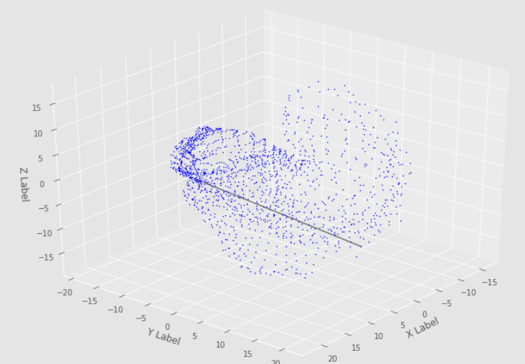

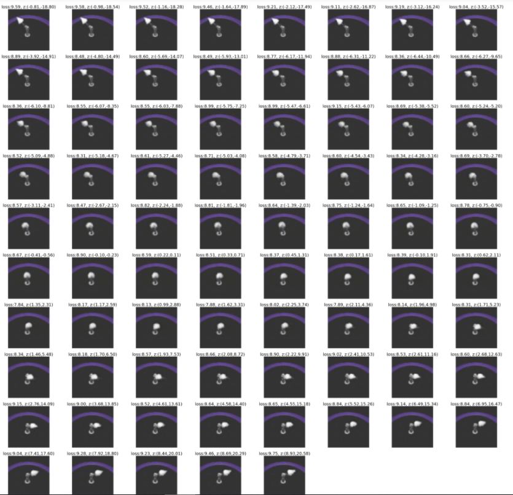
#### Dataset with 3 degrees of freedom

We also tried to train an autoencoder with 3 degrees of freedom. Unfortunately, the dataset used (see section 3.) does not have a third dimension which takes a large amount of values. This led the DAE to create a latent space in which images varying in the third dimension were found on different areas in the latent space. This can be clearly seen in figure [] below. 

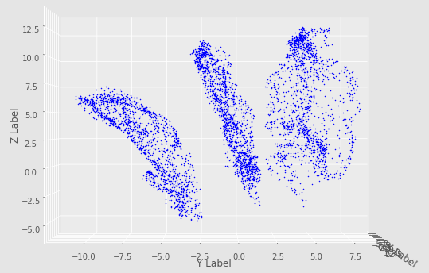

**Figure 19-**: latent space of a dataset with 3 degrees of freedom. The three degrees in this dataset are horizontal axis, vertical axis and camera height Images varying in camera height were mapped to different clusters in the latent space

### Noises

We tried 2 different type of noises- adding gaussian noise with , and setting a ratio r to change a certain percentage of pixels in the image to 0. Best results were produced when using gaussian noise with a value of 0.2.

### Grid search
Throughout the project, we trained the DAE with different hyperparameter values. These possible hyper parameter values were:

batch_sizes- 4, 8, 16

- (1, 0), (0.7,0.3), (0,1)

Largest Conv2d out channels = 64, 128, 256

noises = 0.1, 0.2, 0.5

noise_types = 'normal', 'white'

we also used several different values for number of epochs, learning rate, and learning rate step size. Table with some of the results is attached to this project as all_scores.csv.

## Conclusions

### Summary
In this project, we were able to train a DAE on a dataset. We used the latent space created by the DAE, to perform data interpolation without explicitly specifying how the images in the dataset vary. We showed our approach of “surfing the manifold” leads to better results than the naïve method of linear interpolation in latent space. In most cases, our approach achieves, smoother, less noisy and less corrupted animation.

Future work can validate this approach by improving the DAE outputs, and by coming up with improved methods for measuring performance of different methods for interpolation.

### Future Work

#### Data

The dataset has only 2 dimensions in which it takes many values- the horizontal and vertical axis parameters. we chose our data to vary only according to these features, which creates a dataset of1600 images. It should be interesting to see how utilizing more data will affect the performance of the DAE. It might be interesting also to see how more data shapes the latent space, and its effects on data interpolation performance.

It can also be useful to create a synthetic dataset, which will allow creating a larger number of inputs. Having the capability of generating images for any set of parameters required, should also allow generating ground truths, and comparing expected interpolations to interpolations generated by various methods (see 6.2.2.).

#### metrics

In this project we used interpolationMSE and visual assessment to judge interpolation performance. InterpolationMSE is useful for measuring how many unrealistic artifacts a certain data interpolation contains. This metric is not totally reliable- an interpolation which randomly transitions between images from the dataset will get a perfect score, even though it is clearly not an ideal interpolation.

Even thought that given two images, there is no “perfect” interpolation, lets assume that we can think of a finite set of valid data interpolations. The if we have the capability of creating synthetic data, namely generating all images in these data interpolations, we can also come up with an improved metric for data interpolation performance. For a given interpolation, we can compare (using MSE or some other similarity metric) each image in this interpolation to the corresponding image in each of the perfect interpolations. The score will be the minimal average distance between the interpolation and one of the perfect interpolations.

Further research is of course needed to determine what can be considered a “perfect” interpolation.

#### Different approach
There are more types of autoencoders that can be useful for our project. One example is the Variational Autoencoder, which restricts the point in the latent space to fall under the prior distribution of the given dataset. 

Another development in the field of Autoencoders is the Adversarial autoencoder. Which use a discriminator in the latent domain, to try and figure if a latent vector is from prior distribution or from the encoder. We made a few attempts to use a discriminator on the output as perceptual loss, but we didn’t reach satisfying results.

If trained correctly, we expect such autoencoders to improve the decoded output greatly.

## References
**[1] Y.Bengio, A.Courville and P.Vincent, "Representation Learning: A Review and New Perspectives", Department of computer science and operations research, U. Montreal also, Canadian Institute for Advanced Research (CIFAR), 2014.
[2] I.Goodfellow, Y.Bengio and A.Courville, "Deep Learning", MIT Press, 2016.
[3] P.Vincent, H.Larochelle, Y.Bengio and P.A.Manzagol, "Extracting and Composing RObust Features with Denoising Autoencoders", International Conference on Machine Learning, 2008.
[4] J.Johnson, A.Alahi and L.Fei-Fei, "Perceptual Losses for Real-Time Style Transfer and Super-Resolution, arXiv 2016.
[5] G.G. Pihlren, F.Sandin and M.Liwicki, "Improving Image Autoencoder Embedding with Perceptual Loss", arXiv 2020.
[6] A.Oring, Z. Yakhini, Y.Hel-Or, "Faithful Autoencoder Interpolation by Shaping and Latent Space", arXiv 2020.